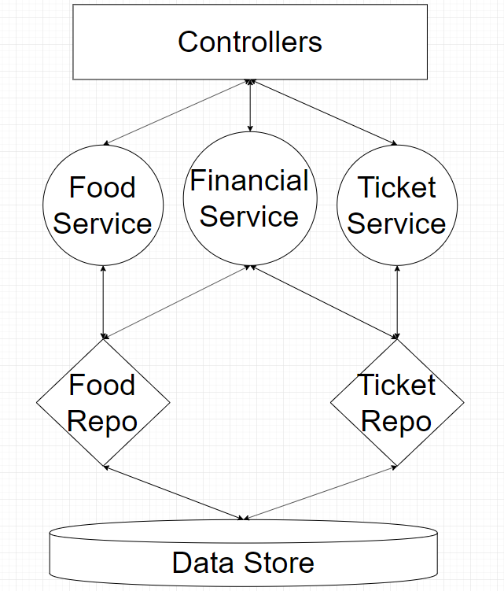

#Aspire Test Project
Copyright by Tat Pham

Guide line content

## About Project

This source code use for develop api service write by Laravel framework 7.x, The techs and some tool for develop in this project like as bellow:

- Laravel 7.x.
- PHP 7.4.3.
- Docker & docker compose.
- Postgres SQL 11.
- PHP standard PSR12.
- PHPUnit 8.5.3.
- Source control Git.

The source code can run on both environment MAC & Win.

## About Structure

In this project we use Repository-Service Pattern and DI (Dependency Injection) to develop.



- Service layer will handle logic.
- Repo layer will handle access to data.
- Model class is instance of table in db use getter and setter method to access.

## Setup on Local

Prerequisite:
- Make sure you already install docker for window and git on your local.
- After install docker, you turn on docker and setup up share the drive that you are working on (the drive contain the source code).

on Docker setting go to `Resources > FILE SHARING ` and turn on the drive that you want to sharing.

###1. Clone the source code from `develop` branch on your local

`$ git clone https://ppt-gbc.backlog.com/git/DEV_MUSASINO/musashino_BE.git`

###2. Start docker

This step only for one time, for the next time the docker will start automatic.
Open your visual studio code (or any IDE have terminal) open the folder contain the source code.
Open terminal of visual studio and run command bellow (this command only run one time for build docker image).

`$ docker-compose up --build -d`

###3. Install composer

For the first time you need install composer to run laravel by this command

Go to in container by this command 

`$ docker exec -it webserver bash`

After that run command

`$ composer install`

###4. Create .env file

From the source code copy file `.env.local` to `.env` and run this command

Go to in container by this command 

`$ docker exec -it webserver bash`

After that run command 

`$ php artisan key:generate`

###5. Create database

In this project we use function migration and seed of laravel to create data base and import data sample for dev, So from now anytime you want to create new db you just run follow command.

Go to in container by this command 

`$ docker exec -it webserver bash`

After that run command 

`$ php artisan migrate:fresh --seed`

###6. Config PSR12

Run this command to install php variable standard

`$ vendor/bin/phpcs --config-set installed_paths vendor/sirbrillig/phpcs-variable-analysis/` 

After these steps you have an environment for develop api by docker.

Note: To run commandline like as phpunit or git or any you should go to inside container and run it. (It mean you don't need install anything in your local because we use docker.)

## Url in project

###1. For API debug

`http://localhost:8080`

Or

`http://localhost:8081`

###2. For PgAdmin

`http://localhost:8082`

You can access with username/password is admin@admin.com/123123

###3. For web mail local
~~In this environment I also setup a web mail local for dev, It mean if you send mail on local it will auto send to this mail server.
We use AWS SES from develop in Musashino-Project. That setting is done in the env file.~~
~~`http://localhost:8083`~~

###3. For redis admin

`http://localhost:8084`

###5. For load balancer

In this project already setup load balance you can access on this url

`http://localhost`

## Coding rule

In this project we use coding rule follow PSR12 standard, and I already setup pre-commit hook to check your coding rule before them be pushed to server.
If your code is not pass PSR12 it can not commit by git.

This is some codding rule you have to follow in this project:

- 4 spaces must be used for indents. Using tabs is not allowed
- You must put a newline before curly braces for classes and methods
- You must not put a newline before curly braces in conditional statements
- You must not put any spaces before ( and ) in conditional statements

But don't worry I already help you format it before you commit source code so no need care about this one.

## Naming rule

You have to follow this one:

Code: 
- use camelCase when you name parameters or name function name.
- action name have to be verb.
- response data use snake_case.
- write unit test for controller function at least handle response 200

URIs: 
- use hyphens (-) in URIs
- use lowercase letters in URIs paths
- use forward slash separator (/) must be used to indicate a hierarchical relationship.
- uri have to be write in `api.php` route.
- uri have to be put in a prefix with name is plural.
- have to put name for uri.


## Folder structure

```

app													
    Common												
        Helpers				This folder will contain helper class
            S3Helper.php										
            ArrayHelper.php										
            FirebaseHelper.php										
            StringHelper.php										
        Interfaces			This folder will contanin common interfaces
            Repository.php										
            Service.php										
    Console												
        Commands			This folder I already command line to help generate repository file service file action test case.
        Kernel.php											
    Core				This folder for the file override the core
        QueryBuilderWithCache.php											
    Exceptions				Handle exception of api in this folder
        ApplicationException.php											
        Handler.php											
        MyException.php											
    Http												
        Controllers			The folder contain controllers
        Middleware			The folder contain middleware files
        Requests			The folder contain request class
        Kernel.php											
    Jobs			        The folder contain job handle
        ProcessForgotPassword.php											
    Mail												
        ForgotPassword.php											
    Models												
        Traits											
            Cacheables.php										
        BillModel.php											
        MemberModel.php											
        ...											
    Providers				This folder is default of laravel it define providers in app
    Repositories			This folder will contain repository class layer to interact with db, all query will be write in here
        BillRepository											
            BillRepository.php	        This is interface file
            BillRepositoryImpl.php	This is implement file
        MemberRepository											
            MeberRepository.php										
            MemberRepositoryImpl.php										
        ...											
    Services				This folder is layer service will contain service class to handle implement logic code
        BillServiceService											
            BillService.php		This is interface file
            BillServiceImpl.php		This is implement file
        MemberServiceService											
            MemberService.php		This is interface file
            MemberServiceImpl.php	This is implement file
        ...											
config					This folder is default to contain config file
database				This folder contain migration file and seed file for testing
	migrations												
	seeds												
public					This is public folder for framework
resources				Folder contain view and other resource
routes					This folder contain router api uri
storage					This folder contain file log or some private file in it
tests					Folder use for write unit test
.env		

```

## Git flow

Note: I recommend you should type command line inside container. `$ docker exec -it webserver bash` 

##1. Main branches
We have two main branches with an infinite lifetime:

- master
- develop

The `master` branch where the source code of `HEAD` always reflects a production-ready state.
The `develop` branch where the source code of `HEAD` always reflects a state with the latest delivered development changes for the next release.

##2. Supporting branches

Unlike the main branches, these branches always have a limited life time, since they will be removed eventually.

The different types of branches we may use are:

- feature
- release
- hotfix

And we have the strict rules as to which branches may be their originating branch and which branches must be their merge targets.

###a. Feature branches
When starting work on a new feature, branch off from the develop branch.

May branch off from:

`develop`

Must merge back into:

`develop`

Branch naming convention:

Anything except `master`, `develop`, `release-*`, or `hotfix-*`

Recommend is `feature-*`

Create new branch off from the develop branch and checkout to this branch:

```
$ git checkout -b feature-myfeature develop
Switched to a new branch "feature-myfeature"
```

Merge the latest source code from `develop` branch and make `pull request` on backlog git.

```
$ git add .
$ git commit -m "#TaskName_on_backlog and your comment here"
$ git pull origin develop
Updating ea1b82a..05e9557
(Summary of changes)
$ git push --set-upstream origin your_branch_name
(* [new branch]  your_branch_name -> your_branch_name)
```

After push your local branch to remote branch, you go to git on backlog and make pull request to develop. Because you code need to be reviewed by someone.

###b. Release branches
Release branches support preparation of a new production release. 
May branch off from:

`develop`

Must merge back into:

`develop and master`

Branch naming convention:

`release-*`

Creating a release branch

`1.2` is version number for this release.

```
$ git checkout -b release-1.2 develop
Switched to a new branch "release-1.2"
$ git commit -a -m "Bumped version number to 1.2"
$ git push --set-upstream origin release-1.2
```

After push it to server you test and hot fix on from this branch but adding large new features here is strictly prohibited. They must be merged into `develop`, and therefore, wait for the next big release.

Finishing a release branch:

Some actions need to be carried out after release success. 

First, The release branch need to be merged into `master`

```gitignore
$ git checkout master
Switched to branch 'master'
$ git merge --no-ff release-1.2
Merge made by recursive.
(Summary of changes)
```

Next, that commit on master must be tagged for easy future reference to this historical version.

```gitignore
git tag -a v1.2 -m "my version 1.2"
git push origin v1.2
```

Finally, the changes made on the release branch need to be merged back into develop, so that future releases also contain these bug fixes.

```gitignore
$ git checkout develop
Switched to branch 'develop'
$ git merge --no-ff release-1.2
Merge made by recursive.
(Summary of changes)
$ git push origin
```

###b. Hotfix branches

Hotfix branches are very much like release branches in that they are also meant to prepare for a new production release, albeit unplanned. 

May branch off from:

`master`
Must merge back into:

`develop and master`

Branch naming convention:

`hotfix-*`

Creating the hotfix branch:

```
$ git checkout -b hotfix-1.2.1 master
Switched to a new branch "hotfix-1.2.1"
$ git commit -a -m "Bumped version number to v1.2.1"
[hotfix-1.2.1 41e61bb] Bumped version number to v1.2.1
1 files changed, 1 insertions(+), 1 deletions(-)
$ git push --set-upstream origin hotfix-1.2.1
```

Finishing a hotfix branch:

```gitignore
$ git checkout master
Switched to branch 'master'
$ git merge --no-ff hotfix-1.2.1
Merge made by recursive.
(Summary of changes)
$ git tag -a v1.2.1
$ git push origin v1.2.1
```

Next, include the bugfix in develop, too:

```gitignore
$ git checkout develop
Switched to branch 'develop'
$ git merge --no-ff hotfix-1.2.1
Merge made by recursive.
(Summary of changes)
$ git push
```

Note: Developer only need care about `feature` branch

## Guide Xdebug

This is guide use xdebug for Visual Studio code.

- Go to debug panel
- Click to `Config` button (the cogwheel) and select PHP.
- And replace content in node `configurations` by config below.

Note: Actually I added this config file to source code you just pull and use it.

```json
{
    "name": "Listen for XDebug",
    "type": "php",
    "request": "launch",
    "log": true,
    "pathMappings": {
        "/var/www/html": "${workspaceFolder}"
    },
    "ignore": [
        "**/vendor/**/*.php"
    ]       
}
```

Now try set breakpoint on php file that you want to debug and press button `start debugging` and enjoy xdebug working now.


## Generate code command

In this project I already build some small script for help developer generate code like as Model class, Service class, Repository class, Action and Test case... It will save your time so much if you use them.

Note: All command should be run inside container

`$ docker exec -it webserver bash`

###1. Generate model

This command will help you generate auto model and repository class, you can config which one table need to be generated in `config/generate-model.php`, in this file you also config to generate constant value in DB base on column as you want.

`$ php artisan generate:model`

###2. Generate service

This command will help you generate a service class, it will help you auto config to binding new class to App Service, if you create by hand service class you have to config by hand in `config/bind.php`

`$ php artisan generate:service`

###3. Generate action

This command will help you auto generate a action and config uri of it and auto generate a basic skeleton unit test for this action.

`$ php artisan generate:action`

Note: In model and repository class you will see this comment, please don't delete it and don't modify code after this comment because generate base on this comment to generate code. All code if you add by hand bellow this comment will be deleted if you run generate code again.

```
    // AUTO GENERATED - DO NOT MODIFY FROM HERE
    //*************************************************
```

###4. Run unit test

Run phpunit test on single method

`$ vendor/bin/phpunit --filter methodName path/to/file.php`

Run all test case by this command

`$ vendor/bin/phpunit`

## Docker command

This this project I already setup docker for developer and this is some command line help check your docker work or not, or some thing like that.

- Check docker work or not.

`$ docker ps -a`

- Restart a docker

`$ docker restart docker_name`

- Restart all docker container in this project

`$ docker restart $(docker ps -q)`

- Start docker for this project

`$ docker-compose up -d`

- Stop docker but still keep state of container

`$ docker-compose stop `

- Remote all docker container

`$ docker-compose down`

- Check log of a container

`$ docker logs conatiner_name_or_id`

- List docker image on your machine

`$ docker images`
