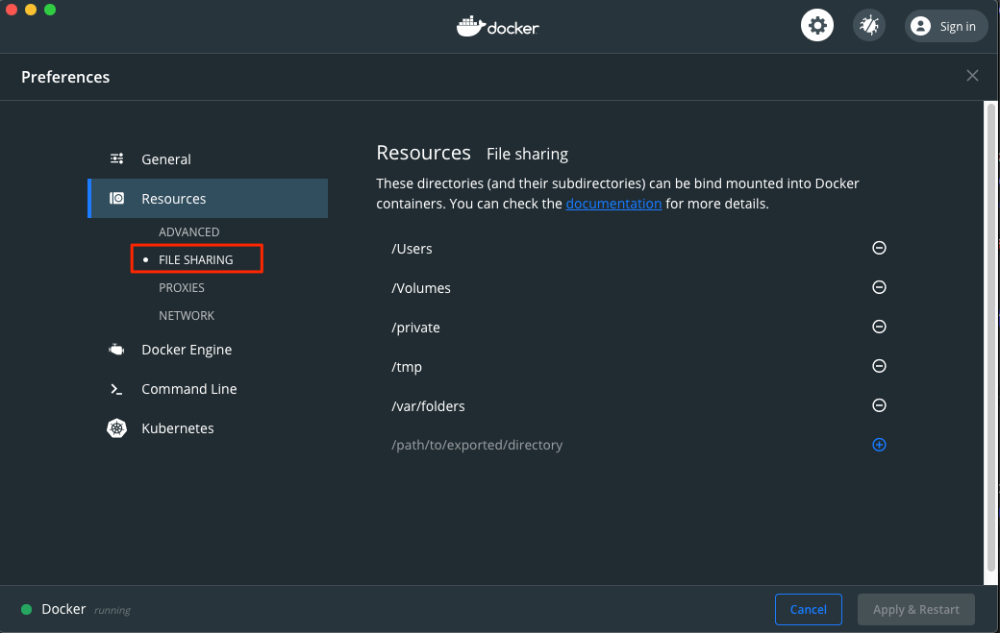
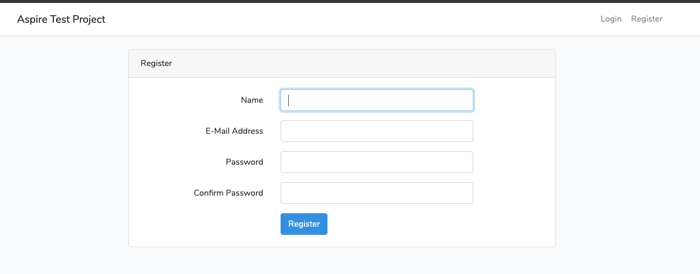
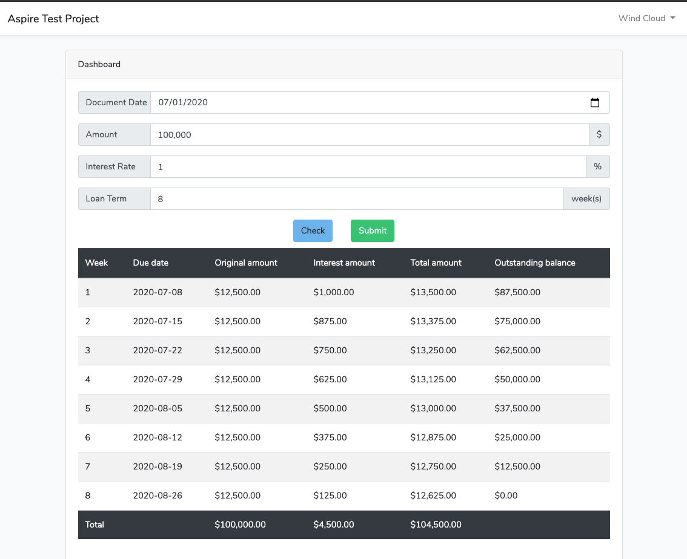
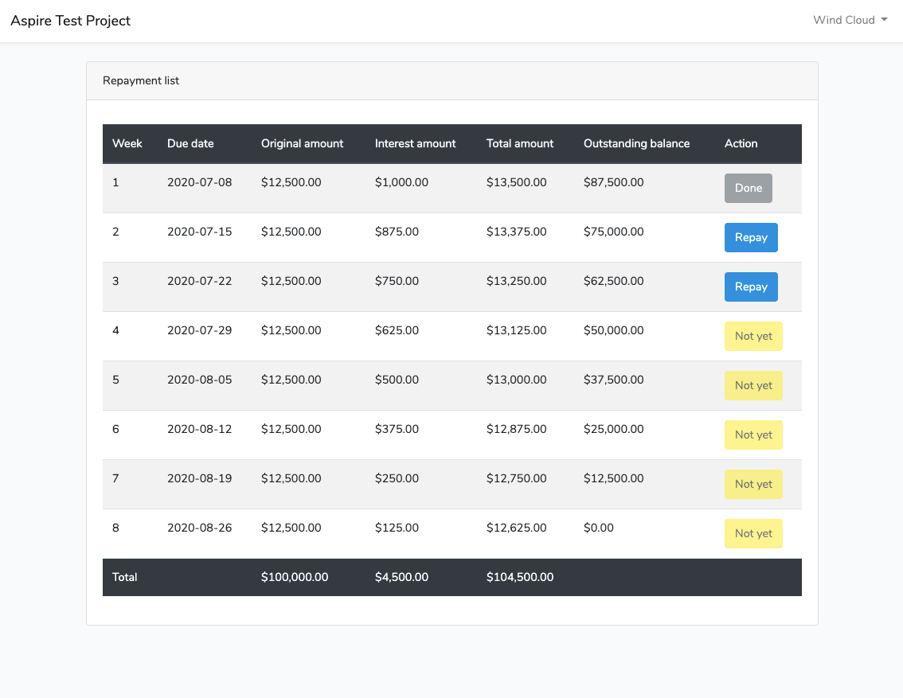

# Aspire Test Project

Copyright by Tat Pham

Guide line content

- [About Project](#about-project)
- [About Structure](#about-structure)
- [Setup on Your Local](#setup-on-your-local)
    - [1. Clone the source code from develop branch on your local](#1-clone-the-source-code-from-develop-branch-on-your-local)
    - [2. Start docker](#2-start-docker)
    - [3. Install composer](#3-install-composer)
    - [4. Create .env file](#4-create-env-file)
    - [5. Create database](#5-create-database)
    - [6. Config PSR12 (Only for develop)](#6-config-psr12-only-for-develop)
- [Url in project](#url-in-project)
    - [1. For API debug](#1-for-api-debug)
    - [2. For PgAdmin](#2-for-pgadmin)
- [Coding rule](#coding-rule)
- [Naming rule](#naming-rule)
- [Folder structure](#folder-structure)
- [Generate code command](#generate-code-command)
    - [1. Generate model](#1-generate-model)
    - [2. Generate service](#2-generate-service)
    - [4. Run unit test](#4-run-unit-test)
- [Docker command](#docker-command)
- [Guide exec test project](#guide-exec-test-project)
    - [1. Login](#1-login)
    - [2. Home page](#2-home-page)
    - [Repayment page](#3-repayment-page)
 
## About Project

This source code use for develop api service write by Laravel framework 7.x, The techs and some tool for develop in this project like as bellow:

- Laravel 7.x.
- PHP 7.4.3.
- Docker & docker compose.
- Postgres SQL 11.
- PHP standard PSR12.
- PHPUnit 8.5.3.
- Source control Git.

The source code can run on both environment MAC & Win.

## About Structure

In this project we use Repository-Service Pattern and DI (Dependency Injection) to develop.


- Service layer will handle logic.
- Repo layer will handle access to data.
- Model class is instance of table in db use getter and setter method to access.

## Setup on Your Local

Prerequisite:
- Make sure you already install docker and git on your local.
- After install docker, you turn on docker and setup up share the drive that you are working on (the drive contain the source code).

on Docker setting go to `Resources > FILE SHARING ` and turn on the drive that you want to sharing.



### 1. Clone the source code from `develop` branch on your local

`$ git clone https://github.com/windcloudit/mini-aspire.git`

### 2. Start docker

This step only for one time, for the next time the docker will start automatic.
Open your visual studio code (or any IDE have terminal) open the folder contain the source code.
Open terminal of visual studio and run command bellow (this command only run one time for build docker image).

`$ docker-compose up --build -d`

### 3. Install composer

For the first time you need install composer to run laravel by this command

Go to in container by this command 

`$ docker exec -it webserver bash`

After that run command

`$ composer install`

### 4. Create .env file

From the source code copy file `.env.example` to `.env` and run this command

Go to in container by this command 

`$ docker exec -it webserver bash`

After that run command 

`$ php artisan key:generate`

### 5. Create database

In this project I use function migration and seed of laravel to create data base and import data sample for dev, So from now anytime you want to create new db you just run follow command.

Go to in container by this command 

`$ docker exec -it webserver bash`

After that run command 

`$ php artisan migrate:fresh --seed`

### 6. Config PSR12 (Only for develop)

Run this command to install php variable standard, if you want to commit source code to, because this source code already setup PSR12 in git hook.

`$ vendor/bin/phpcs --config-set installed_paths vendor/sirbrillig/phpcs-variable-analysis/` 

After these steps you have an environment for develop api by docker.

Note: To run commandline like as phpunit or git or any you should go to inside container and run it. (It mean you don't need install anything in your local because we use docker.)

## Url in project

### 1. For API debug

`http://localhost:8080`

### 2. For PgAdmin

`http://localhost:8081`

You can access with username/password is admin@admin.com/123123

## Coding rule

In this project I use coding rule follow PSR12 standard, and I already setup pre-commit hook to check your coding rule before them be pushed to server.
If your code is not pass PSR12 it can not commit by git.

This is some codding rule you have to follow in this project:

- 4 spaces must be used for indents. Using tabs is not allowed.
- You must put a newline before curly braces for classes and methods.
- You must not put a newline before curly braces in conditional statements.
- You must not put any spaces before ( and ) in conditional statements.

But don't worry I already help you format it before you commit source code so no need care about this one.

## Naming rule

We following this one:

Code: 
- use camelCase when you name parameters or name function name.
- action name have to be verb.
- response data use snake_case.
- write unit test for controller function at least handle response 200

URIs: 
- use hyphens (-) in URIs
- use lowercase letters in URIs paths
- use forward slash separator (/) must be used to indicate a hierarchical relationship.
- uri have to be put in a prefix with name is plural.
- have to put name for uri.

## Folder structure

```

app													
    Common												
        Helpers				This folder will contain helper class
            CharsetHelper.php								
        Interfaces			This folder will contanin common interfaces
            Repository.php										
            Service.php										
    Console												
        Kernel.php																				
    Exceptions				Handle exception of api in this folder
        ApplicationException.php											
        Handler.php											
        MyException.php											
    Http												
        Controllers			The folder contain controllers
        Middleware			The folder contain middleware files
        Requests			The folder contain request class
        Kernel.php																														
    Models																				
        BaseModel.php											
        ...											
    Providers				This folder is default of laravel it define providers in app
    Repositories			This folder will contain repository class layer to interact with db, all query will be write in here
        BaseRepository											
            BaseRepository.php	        This is interface file
        LoanRegisterRepository											
            LoanRegisterRepository.php										
            LoanRegisterRepositoryImpl.php										
        ...											
    Services				This folder is layer service will contain service class to handle implement logic code
        AuthService											
            AuthService.php		This is interface file
            AuthServiceImpl.php		This is implement file
        LoanRegisterService											
            LoanRegisterService.php	This is interface file
            LoanRegisterServiceImpl.php	This is implement file
        ...											
config					This folder is default to contain config file
database				This folder contain migration file and seed file for testing
	migrations												
	seeds												
public					This is public folder for framework
resources				Folder contain view and other resource
routes					This folder contain router api uri
storage					This folder contain file log or some private file in it
tests					Folder use for write unit test
.env		

```

## Generate code command

In this project I already build some small script for help developer generate code like as Model class, Service class, Repository class, Action and Test case... It will save your time so much if you use them.

Note: All command should be run inside container

`$ docker exec -it webserver bash`

### 1. Generate model

This command will help you generate auto model and repository class, you can config which one table need to be generated in `config/generate-model.php`, in this file you also config to generate constant value in DB base on column as you want.

`$ php artisan generate:model`

### 2. Generate service

This command will help you generate a service class, it will help you auto config to binding new class to App Service, if you create by hand service class you have to config by hand in `config/bind.php`

`$ php artisan generate:service`

### 3. Generate action

This command will help you auto generate a action and config uri of it and auto generate a basic skeleton unit test for this action.

`$ php artisan generate:action`

Note: In model and repository class you will see this comment, please don't delete it and don't modify code after this comment because generate base on this comment to generate code. All code if you add by hand bellow this comment will be deleted if you run generate code again.

```
    // AUTO GENERATED - DO NOT MODIFY FROM HERE
    //*************************************************
```

### 4. Run unit test

Run phpunit test on single method

`$ vendor/bin/phpunit --filter methodName path/to/file.php`

Run all test case by this command

`$ vendor/bin/phpunit`

## Docker command

This project I already setup docker for developer and this is some command line help check your docker work or not, or some thing like that.

- Check docker work or not.

`$ docker ps -a`

- Restart a docker

`$ docker restart docker_name`

- Restart all docker container in this project

`$ docker restart $(docker ps -q)`

- Start docker for this project

`$ docker-compose up -d`

- Stop docker but still keep state of container

`$ docker-compose stop `

- Remote all docker container

`$ docker-compose down`

- Check log of a container

`$ docker logs conatiner_name_or_id`

- List docker image on your machine

`$ docker images`

## 5. Guide exec test project

### 1. Login

After setup and run seed data you can login test web by this account

tat.pham89@gmail.com/123123

Or you can create your about by yourself by register page



### 2. Home page

After login you can see the main page, in this page you can input info to check your loan and submit your loan.
In this page have some fields bellow:

- Document date: Time start of this loan (date)
- Amount: amount of this loan (number)
- Interest Rate: The interest how many percent of this loan per week (float).
- Loan term: This is loan term (number)

After input you can check your loan before submit if everything ok you can submit it.



After submit you will be redirected to repayment page.

### 3. Repayment page



In this page you can repay your loan per week, if this row is lesser than now, you can repay it and you only can repay of your loan only.
